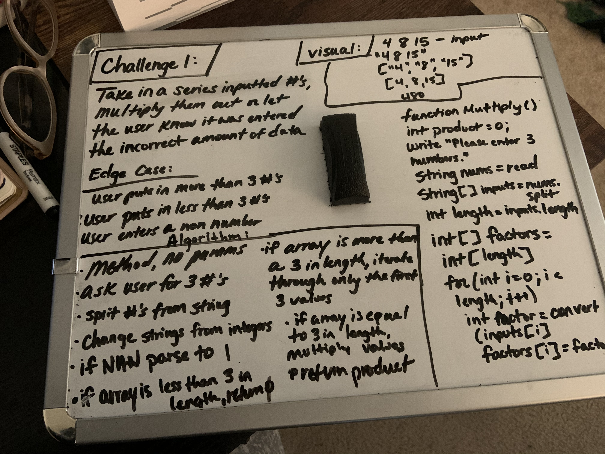

# SystemIO 

## Description 
- This is a console application made to solve several code challenges with a very basic UI.

## To Use This Program
- This program is not published anywhere but can be used through VS.

## 

## Whiteboard Challenge 1

## Challenge 2:
- Convert the array to an integer
- Iterate through the array and assign each index to the value input by the user
- When iterating through, take the highest value & replace

## Challenge 3: 
- Find how many spaces we needed to go over, noticed right away it was going 1, 3, 5, 7, 9, etc.
- Iterate through that array to figure out where to add and subtract in order to display 